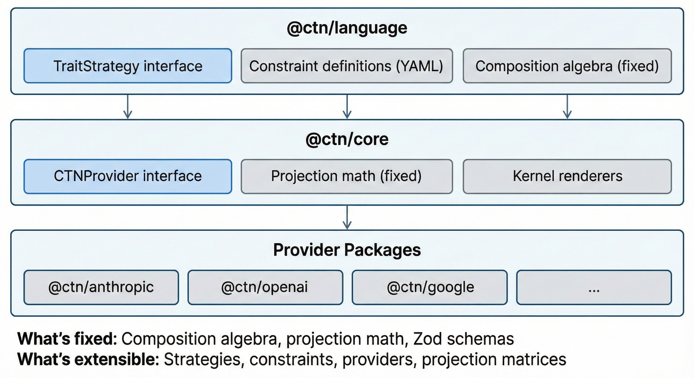
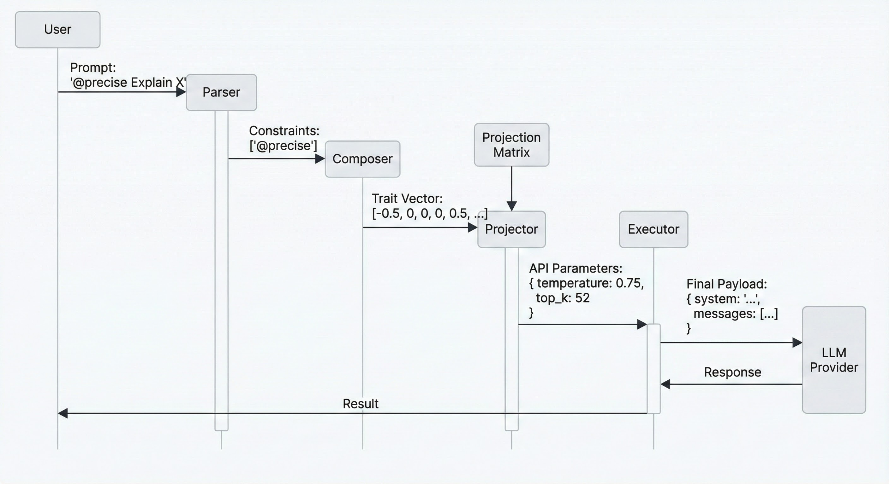
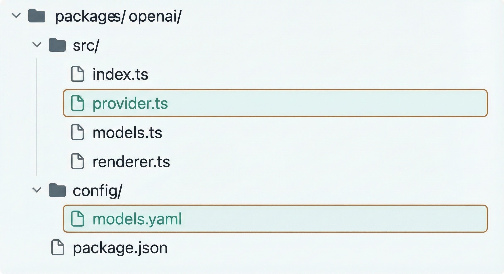
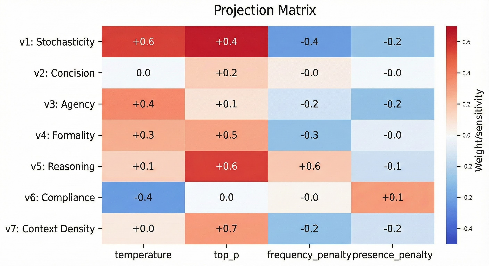

# Contributing to CTN SDK

This guide explains how to extend the CTN SDK with new providers, strategies, and constraints.

---

## Architecture Overview

The CTN SDK is designed around a **three-layer decoupled architecture** that separates semantic intent from physical API execution.



| Layer | Role | Contains |
|-------|------|----------|
| **@ctn/language** | The "brains" | TraitStrategy interface, YAML constraint definitions, fixed composition algebra |
| **@ctn/core** | The "engine" | CTNProvider interface, fixed projection math, kernel renderers |
| **Provider Packages** | The "drivers" | API-specific implementations (Anthropic, OpenAI, Google, ...) |

**What's fixed:** Composition algebra, projection math, Zod schemas  
**What's extensible:** Strategies, constraints, providers, projection matrices

---

## Extension Pipeline

When adding new features, understand how data flows from user prompt to LLM response.



| Stage | Component | Input | Output |
|-------|-----------|-------|--------|
| 1. **Parse** | Parser | `"@precise Explain X"` | `['@precise']` + `"Explain X"` |
| 2. **Compose** | Composer | Constraint list | Trait vector `[-0.5, 0, 0, 0, 0.5, ...]` |
| 3. **Project** | Projector | Trait vector + Matrix | API params `{temperature: 0.75, top_k: 52}` |
| 4. **Execute** | Executor | Params + Kernel + Messages | Final payload → LLM → Response |

---

## Adding a Provider

A provider maps the abstract CTN representation to a specific LLM API.

### 1. Package Structure



```
packages/openai/
├── src/
│   ├── index.ts           # Public exports
│   ├── provider.ts        # OpenAIProvider class (inherits BaseCTNProvider)
│   ├── models.ts          # Model config loader
│   └── renderer.ts        # Markdown kernel renderer
├── config/
│   └── models.yaml        # Model definitions
├── package.json
└── tsconfig.json
```

### 2. Models Config

```yaml
# config/models.yaml
provider: openai

models:
  - id: gpt-4o
    aliases: [gpt4o, 4o]
    contextWindow: 128000
    defaultMaxTokens: 4096
    capabilities:
      thinking: false
      streaming: true

  - id: gpt-4o-mini
    aliases: [mini, 4o-mini]
    contextWindow: 128000
    defaultMaxTokens: 4096
    capabilities:
      thinking: false
      streaming: true
```

### 3. Provider Implementation

```typescript
// src/provider.ts
import { BaseCTNProvider, ProjectedConfig, Message, ProviderResponse } from '@ctn/core';
import OpenAI from 'openai';

export class OpenAIProvider extends BaseCTNProvider {
  readonly id = 'openai';
  readonly name = 'OpenAI';

  private client: OpenAI;

  constructor() {
    super();
    this.client = new OpenAI({
      apiKey: process.env.OPENAI_API_KEY,
    });
    this.registerOperationalProjection();
  }

  private registerOperationalProjection(): void {
    this.registerProjection('operational', '1.0.0', {
      baseline: {
        temperature: 1.0,
        top_p: 1.0,
        frequency_penalty: 0.0,
        presence_penalty: 0.0,
      },
      weights: {
        // [v1, v2, v3, v4, v5, v6, v7]
        temperature:       [0.6,  0,   0,   0,  -0.4, -0.2, 0],
        top_p:             [0.2,  0,   0,   0,  -0.1, -0.1, 0],
        frequency_penalty: [0,    0.3, 0,   0,   0,    0,   0],
        presence_penalty:  [0.2,  0,   0.2, 0,   0,    0,   0],
      },
      scale: {
        temperature: 0.5,
        top_p: 0.1,
        frequency_penalty: 0.5,
        presence_penalty: 0.5,
      },
      clamps: {
        temperature: [0, 2],
        top_p: [0, 1],
        frequency_penalty: [0, 2],
        presence_penalty: [0, 2],
      },
    });
  }

  async send(config: ProjectedConfig, messages: Message[]): Promise<ProviderResponse> {
    const response = await this.client.chat.completions.create({
      model: config.model,
      messages: this.formatMessages(config, messages),
      temperature: config.apiParams.temperature as number,
      top_p: config.apiParams.top_p as number,
      max_tokens: config.apiParams.max_tokens as number | undefined,
    });

    return {
      content: response.choices[0]?.message?.content ?? '',
      usage: {
        inputTokens: response.usage?.prompt_tokens ?? 0,
        outputTokens: response.usage?.completion_tokens ?? 0,
      },
      finishReason: response.choices[0]?.finish_reason ?? 'unknown',
    };
  }

  private formatMessages(config: ProjectedConfig, messages: Message[]) {
    return [
      { role: 'system' as const, content: config.kernel },
      ...messages.map(m => ({
        role: m.role as 'user' | 'assistant',
        content: m.content,
      })),
    ];
  }
}
```

### 4. Kernel Renderer

Each provider can have a preferred kernel format:

| Provider | Format | Example |
|----------|--------|---------|
| Anthropic | XML | `<behavioral_constraints>...</behavioral_constraints>` |
| OpenAI | Markdown | `## Behavioral Constraints\n- ...` |
| Google | Plain | `Behavioral Constraints:\n- ...` |

```typescript
// src/renderer.ts
import { KernelRenderer, KernelIR } from '@ctn/core';

export class MarkdownKernelRenderer implements KernelRenderer {
  render(ir: KernelIR): string {
    if (ir.clauses.length === 0) return '';
    
    const lines = ir.clauses.map(c => 
      `- **${c.traitId}**: ${c.text}`
    );
    return `## Behavioral Constraints\n${lines.join('\n')}`;
  }
}
```

---

## Projection Matrix Tuning

The **Projection Matrix** is the primary tuning mechanism for a provider. It acts as a sensitivity map between trait space and API space.



### Components

| Component | Purpose | Constraint |
|-----------|---------|------------|
| **Baseline** | Starting value when τ = 0 | Must be within clamps |
| **Weights** | Sensitivity of param to each trait | Normalized to [-1, 1] |
| **Scale** | Magnitude multiplier | Maps weight to physical range |
| **Clamps** | Hard API bounds | [min, max] per parameter |

### The Projection Formula

```
P = clip(b + s ⊙ (W · τ), lo, hi)

Where:
  P   = projected API parameters
  b   = baseline vector
  s   = scale vector
  W   = weight matrix
  τ   = trait vector
  lo  = lower clamp bounds
  hi  = upper clamp bounds
```

### Tuning Process

```typescript
// 1. Start with provider defaults as baseline
baseline: {
  temperature: 1.0,  // OpenAI default
  top_p: 1.0,
}

// 2. Map traits to parameters semantically
// v1 (Stochasticity) → temperature (direct correlation)
// v5 (Reasoning) → temperature (inverse: analytical = lower temp)
// v6 (Compliance) → temperature (inverse: strict = lower temp)

// 3. Set weights based on semantic mapping
weights: {
  temperature: [0.6, 0, 0, 0, -0.4, -0.2, 0],
  //            v1           v5    v6
}

// 4. Scale to appropriate magnitude
scale: {
  temperature: 0.5,  // Max delta from baseline = ±0.5
}

// 5. Clamp to API bounds
clamps: {
  temperature: [0, 2],  // OpenAI's valid range
}
```

### Validation

The SDK validates projection matrices at registration:

- ✅ `baseline[k]` ∈ `[clamps[k].lo, clamps[k].hi]`
- ✅ `keys(baseline)` = `keys(scale)` = `keys(clamps)`
- ✅ `weights[k].length` = `strategy.dimensions.length`

---

## Adding a Strategy

A strategy defines a new behavioral coordinate system with its own dimensions and semantics.

### 1. Define Dimensions

```yaml
# strategies/coding/strategy.yaml
name: coding
version: "1.0.0"
description: Optimized for code generation and review

dimensions:
  - id: c1
    index: 0
    label: Verbosity
    description: Code comment density
    poles:
      positive: heavily commented
      negative: minimal comments

  - id: c2
    index: 1
    label: Abstraction
    description: Level of abstraction
    poles:
      positive: generic, reusable
      negative: concrete, specific

  - id: c3
    index: 2
    label: Safety
    description: Error handling approach
    poles:
      positive: defensive
      negative: optimistic

thresholds:
  kernel: 0.3
  interaction: 0.5
```

### 2. Define Constraints

```yaml
# strategies/coding/constraints.yaml
constraints:
  - name: documented
    aliases: [commented]
    traits: { c1: 0.7 }

  - name: generic
    aliases: [abstract, reusable]
    traits: { c2: 0.6 }

  - name: defensive
    aliases: [safe, robust]
    traits: { c3: 0.7 }
```

### 3. Define Interactions

```yaml
# strategies/coding/interactions.yaml
interactions:
  - id: abstract-defensive
    traits: [c2, c3]
    condition: both_high
    resolution: priority
    priorityIndex: 1  # c3 (safety) wins
```

### 4. Implement Strategy Class

```typescript
// strategies/coding/strategy.ts
import { TraitStrategy, TraitVector, TraitDimension } from '@ctn/language';

export class CodingStrategy implements TraitStrategy {
  readonly name = 'coding';
  readonly version = '1.0.0';
  readonly dimensions: readonly TraitDimension[];

  identity(): TraitVector {
    return new Array(this.dimensions.length).fill(0);
  }

  add(a: TraitVector, b: TraitVector): TraitVector {
    return a.map((v, i) => v + b[i]);
  }

  // ... resolve(), formatVector(), etc.
}
```

---

## Adding Constraints

Constraints are presets that map to trait vectors and features.

### Simple Trait Constraint

```yaml
- name: research
  aliases: [academic, scholarly]
  description: Academic research style
  traits:
    v1: -0.3    # Slightly deterministic
    v2: -0.4    # Verbose
    v5: 0.7     # Highly analytical
```

### Constraint with Features

```yaml
- name: concise
  aliases: [brief]
  traits:
    v2: 0.5
  features:
    max_tokens: 256
```

### Parameterized Constraint

```yaml
- name: tokens
  description: Set max output tokens
  params:
    - name: n
      type: number
      required: true
      min: 1
      max: 100000
  traits: {}
  features:
    max_tokens: "{{n}}"
```

Usage: `@tokens[n=500]`

---

## Testing and Traceability

Every contribution must be verifiable through the SDK's observability layer.

### Use `--trace` to Verify Changes

```bash
ctn send "@precise Explain X" --trace
```

Shows:
- Parsed constraints
- Composed trait vector
- Projected API parameters
- Generated kernel

### Testing Requirements

| Type | Required For | Tool |
|------|--------------|------|
| **Unit Tests** | All new schemas and logic | `tsx --test` |
| **Algebraic Tests** | Composition rule changes | `fast-check` |
| **Integration Tests** | New providers | Real API (skip if no key) |
| **Property-Based Tests** | Order-independence proofs | `fast-check` |

### Example: Algebraic Property Test

```typescript
import fc from 'fast-check';

describe('composition properties', () => {
  it('is commutative', () => {
    fc.assert(
      fc.property(
        fc.array(traitVectorArb, { minLength: 2, maxLength: 5 }),
        (vectors) => {
          const forward = compose(vectors);
          const reversed = compose([...vectors].reverse());
          return vectorsEqual(forward, reversed);
        }
      )
    );
  });
});
```

---

## Code Style

### TypeScript

- **Strict mode** — `"strict": true` in tsconfig
- **No `any`** — Use `unknown` + Zod parsing at boundaries
- **Readonly** — Immutable interfaces: `readonly` on all fields
- **Pure functions** — Composition and projection are side-effect free

### Zod

- **Schemas at boundaries** — Validate all external input
- **Type inference** — `z.infer<typeof Schema>` for types
- **Refinements** — Use `.refine()` for domain invariants

### Naming

| Entity | Convention | Example |
|--------|------------|---------|
| Classes | PascalCase | `OpenAIProvider` |
| Strategies | lowercase | `"coding"` |
| Constraints | lowercase, hyphens OK | `@step-by-step` |
| Traits | strategy-namespaced | `v1`, `c1` |

---

## Pull Request Checklist

- [ ] Tests pass (`pnpm -r test`)
- [ ] Build succeeds (`pnpm -r build`)
- [ ] No `any` usage (`grep -r "any" src/`)
- [ ] Zod schemas for new types
- [ ] YAML config for new constraints/models
- [ ] README updated if adding features
- [ ] Changelog entry added

---

## Questions?

Open an issue or discussion on GitHub.