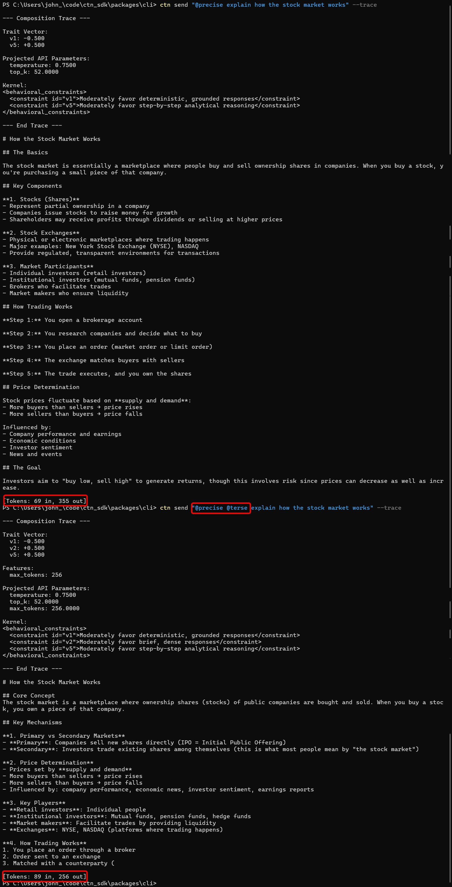

# CTN SDK

**Structured Constraint Composition for LLM Inference**

<p align="center">
  
</p>

> **Solid, boringly correct foundations for practical tools.**

CTN SDK is the reference implementation of [Cognitive Tensor Networks](https://github.com/jpalioto/ctn_core)—a geometric framework for stabilizing LLM inference through structured constraint composition.

**[Design Specification (v1.1.0)](docs/CTN_SDK_Design_Specification_v1.1.0.md)** · **[CTN Whitepaper (PDF)](https://github.com/jpalioto/ctn_core/blob/master/docs/CTN_Whitepaper_v0_1_2.pdf)**

---

## Status: Proof of Concept — NOT FOR PRODUCTION USE

**This is experimental software.** It demonstrates an approach, not a validated solution.

| Aspect | Status |
|--------|--------|
| **Architecture** | Demonstrated — clean extension points, full observability |
| **Algebra** | Proven — 287 tests, associativity/commutativity verified |
| **Multi-Provider** | Implemented — Anthropic, Google, OpenAI |
| **Steering Effectiveness** | Unvalidated hypothesis — no empirical evidence yet |
| **Projection Matrices** | Made up — semantic guesses, not calibrated |
| **Security Review** | Not done — do not use with untrusted input in production |

**Do not use this in production systems.** The API may change. The projection matrices are placeholders. The security model has not been audited.

**Read:** [Why CTN Exists](PHILOSOPHY.md) — explains what this is actually doing (spoiler: no magic, just tokens)

---

## The Problem

LLM APIs expose low-level parameters (temperature, top_k, max_tokens) that:

- **Require trial-and-error tuning** — What does temperature=0.7 *mean* behaviorally?
- **Don't compose predictably** — Setting temperature=0.5 and top_p=0.9 has non-obvious interactions
- **Vary across providers** — OpenAI's parameters ≠ Anthropic's parameters ≠ Google's parameters

The result: brittle configurations, provider lock-in, and no principled way to express behavioral intent.

## The Solution

CTN provides **declarative behavioral constraints** that compose algebraically:

```bash
# Baseline — default parameters, no behavioral steering
ctn send "Explain recursion"

# Constrained — precise + terse compose naturally
ctn send "@precise @terse Explain recursion"

# Works across providers
ctn send "@precise @terse Explain recursion" --provider anthropic
ctn send "@precise @terse Explain recursion" --provider google
ctn send "@precise @terse Explain recursion" --provider openai
```

**Core model:**

1. **Underspecified input →** weak constraints → high variance in output
2. **Well-specified input →** stronger constraints → more stable, predictable output
3. **CTN →** a DSL for expressing "well-specified input" that maps to provider-specific parameters

---

## Quick Start

```bash
# Install
pnpm add @ctn/cli

# Anthropic (default provider)
export ANTHROPIC_API_KEY=sk-ant-...
ctn send "@precise @terse Explain the stock market"

# Google
export GEMINI_API_KEY=your-key
ctn send "@precise @terse Explain the stock market" --provider google

# OpenAI
export OPENAI_API_KEY=your-key
ctn send "@precise @terse Explain the stock market" --provider openai
```

---

## Multi-Provider Support

CTN provides consistent behavioral semantics across providers. The same constraints produce comparable behavior regardless of backend.

| Provider | Alias | Default Model | Environment Variable |
|----------|-------|---------------|---------------------|
| Anthropic | `claude` | `sonnet` | `ANTHROPIC_API_KEY` |
| Google | `gemini` | `gemini-2.5-flash` | `GEMINI_API_KEY` |
| OpenAI | `gpt` | `gpt-5-mini` | `OPENAI_API_KEY` |

```bash
# Compare responses across providers
ctn send "@precise @terse Summarize quantum computing" -p anthropic
ctn send "@precise @terse Summarize quantum computing" -p google
ctn send "@precise @terse Summarize quantum computing" -p openai
```

### Available Models

**Anthropic:**
- `claude-sonnet-4-5-20250929` (alias: `sonnet`) — default
- `claude-opus-4-5-20251101` (alias: `opus`)
- `claude-haiku-4-5-20251001` (alias: `haiku`)

**Google:**
- `gemini-2.5-flash` (alias: `flash`) — default
- `gemini-2.5-pro` (alias: `pro`)
- `gemini-3-pro-preview`
- `gemini-3-flash-preview`

**OpenAI:**
- `gpt-5-mini` (alias: `gpt-mini`) — default
- `gpt-5.2` (alias: `gpt`)
- `gpt-5.2-pro`
- `gpt-5.1`
- `gpt-5.1-codex` (alias: `codex`)

---

## Example: Constraint Composition



The same prompt with different constraints:

| Constraints | Output | Effect |
|-------------|--------|--------|
| `@precise` | Detailed, structured explanation | Steered toward deterministic, analytical |
| `@precise @terse` | Dense summary | Steered toward brevity through traits |

The `--trace` flag reveals the machinery:

```
--- Composition Trace ---
Provider: anthropic (sonnet)

Strategy: operational (v1.0.0)

Trait Vector:
  v1: -0.500    # Stochasticity (negative = deterministic)
  v2: +0.500    # Concision (positive = terse)
  v5: +0.500    # Reasoning (positive = analytical)

Projected API Parameters:
  temperature: 0.7500
  top_k: 52.0000

Kernel:
<behavioral_constraints>
  <constraint id="v1">Moderately favor deterministic, grounded responses</constraint>
  <constraint id="v2">Moderately favor brief, dense responses</constraint>
  <constraint id="v5">Moderately favor step-by-step analytical reasoning</constraint>
</behavioral_constraints>

--- End Trace ---
```

**Key insight:** Brevity is achieved through behavioral steering (the kernel clause), not mechanical truncation. The model *chooses* to be brief.

---

## How It Works

```
1. PARSE         Extract @constraints from prompt
2. RESOLVE       Map constraint names → trait vectors
3. COMPOSE       N-ary vector addition (associative, commutative)
4. NORMALIZE     Saturating normalization to unit ball (‖τ‖ ≤ 1)
5. INTERACT      Resolve semantic conflicts (non-expansive)
6. PROJECT       Map traits → provider-specific API parameters
7. RENDER        Generate behavioral kernel clauses
8. SEND          Execute API call with projected configuration
```

**Key invariants (proven by 287 tests):**

| Property | Guarantee |
|----------|-----------|
| Commutative | `@a @b` = `@b @a` |
| Associative | Grouping doesn't matter |
| Bounded | ‖τ‖ ≤ 1 after composition |
| Non-expansive | Interactions never increase magnitude |

---

## Constraints Reference

### Behavioral Constraints (Traits)

| Constraint | Effect | Trait Vector |
|------------|--------|--------------|
| `@precise` | Deterministic, grounded | v1:-0.5, v5:+0.5 |
| `@creative` | Exploratory, varied | v1:+0.5 |
| `@balanced` | Neutral baseline | (none) |
| `@terse` | Brief, dense | v2:+0.5 |
| `@verbose` | Detailed, thorough | v2:-0.5 |
| `@analytical` | Step-by-step reasoning | v5:+0.8 |
| `@intuitive` | Pattern-based reasoning | v5:-0.5 |
| `@formal` | Professional tone | v4:+0.5 |
| `@casual` | Conversational tone | v4:-0.5 |
| `@focused` | On-topic, narrow | v3:+0.5 |
| `@exploratory` | Tangential, broad | v3:-0.5 |
| `@grounded` | Evidence-based | v7:+0.5 |
| `@speculative` | Hypothesis-based | v7:-0.5 |
| `@strict` | Literal adherence | v6:+0.5 |
| `@flexible` | Flexible interpretation | v6:-0.5 |

### Mechanical Constraints (Features)

Features are only used for settings that MUST be mechanical—things that cannot be achieved through behavioral steering.

| Constraint | Effect |
|------------|--------|
| `@nomemory` | context: none |
| `@lastN[n=5]` | context: { last: 5 } |

### Trait Dimensions (Operational Strategy)

| ID | Dimension | Negative Pole | Positive Pole |
|----|-----------|---------------|---------------|
| v1 | Stochasticity | Deterministic | Creative |
| v2 | Concision | Verbose | Terse |
| v3 | Agency | Reactive | Proactive |
| v4 | Formality | Casual | Formal |
| v5 | Reasoning | Intuitive | Analytical |
| v6 | Compliance | Flexible | Strict |
| v7 | Context Density | Sparse | Dense |

---

## CLI Usage

```bash
# Basic
ctn send "Hello world"

# With constraints
ctn send "@precise @terse Explain recursion"

# Provider selection
ctn send "Hello" -p anthropic      # Default
ctn send "Hello" -p google         # Google Gemini
ctn send "Hello" -p openai         # OpenAI GPT-5
ctn send "Hello" -p gemini         # Alias for google
ctn send "Hello" -p gpt            # Alias for openai
ctn send "Hello" -p claude         # Alias for anthropic

# Model selection
ctn send "Hello" -m opus           # Claude Opus 4.5
ctn send "Hello" -m sonnet         # Claude Sonnet 4.5 (default for Anthropic)
ctn send "Hello" -m haiku          # Claude Haiku 4.5
ctn send "Hello" -p google -m pro  # Gemini 2.5 Pro
ctn send "Hello" -p openai -m gpt  # GPT-5.2

# Streaming (tokens appear as generated)
ctn send "@creative Tell me a story" --stream

# Show composition and projection trace
ctn send "@analytical Solve 2x + 5 = 13" --trace

# Grounding (fetch URL content as context)
ctn send "@terse Summarize this" --ground https://example.com/doc.md

# Dry run (show config without API call)
ctn send "@precise @terse Hello" --dry-run

# Strategy selection
ctn send "@terse Hello" -S operational   # Default
ctn send "@clarity Hello" -S ctn         # CTN strategy
```

### CLI Flags Reference

| Flag | Short | Description |
|------|-------|-------------|
| `--provider <name>` | `-p` | Provider: anthropic, google, openai (or aliases: claude, gemini, gpt) |
| `--model <name>` | `-m` | Model name or alias |
| `--strategy <name>` | `-S` | Strategy: operational (default), ctn |
| `--ground <url>` | `-g` | Ground prompt with content from URL |
| `--stream` | `-s` | Stream response tokens |
| `--trace` | | Show composition and projection traces |
| `--dry-run` | | Show projected config without sending |

---

## Architecture

```
@ctn/language (stable, provider-agnostic)
├── Parser         @constraint syntax extraction
├── Composer       N-ary composition with saturation
├── Strategies     Operational, CTN
├── Interactions   Semantic conflict resolution
└── KernelIR       Provider-agnostic kernel representation
              │
              ▼
@ctn/core (stable, provider-agnostic)
├── Projection     P = clip(b + s ⊙ (W · τ), lo, hi)
├── Validation     Zod schemas at all boundaries
├── Renderers      XML, Markdown, PlainText
└── Renderer Negotiation  Capability-based kernel format selection
              │
              ▼
Provider Packages (provider-specific)
├── @ctn/anthropic    Claude models, XML kernels
├── @ctn/google       Gemini models, Markdown kernels
└── @ctn/openai       GPT-5 models, Markdown kernels
```

### Packages

| Package | Description |
|---------|-------------|
| `@ctn/language` | Constraint parsing, composition algebra, strategies, Zod schemas |
| `@ctn/core` | Projection matrices, provider interface, kernel renderers |
| `@ctn/anthropic` | Claude provider (Sonnet, Opus, Haiku) |
| `@ctn/google` | Gemini provider (2.5 Flash/Pro, 3 Preview) |
| `@ctn/openai` | OpenAI provider (GPT-5.x family) |
| `@ctn/cli` | Cross-platform command-line tool |

---

## Design Principles

### Constraints, Not Commands

Constraints are declarative specifications of desired behavior. They compose algebraically. They do not prescribe implementation.

### Composition Over Configuration

Instead of tuning individual parameters, compose behavioral constraints. The SDK handles the projection to provider-specific parameters.

### Observable by Default

Every transformation is traceable. Composition traces show how constraints combine. Projection traces show how traits become parameters.

### Provider-Agnostic Semantics

`@precise` means the same thing regardless of whether you're using Anthropic, OpenAI, or Google. The projection matrices differ; the semantics don't.

---

## Formal vs Empirical Claims

The SDK separates:

**Provable (compiler semantics):**
- Parsing → IR → composition → projection → final request
- These transformations are deterministic and tested

**Empirical (steering semantics):**
- Whether these transformations reduce variance or improve controllability
- These are hypotheses to be validated experimentally

The specification does not claim traits are orthogonal *in the model*, only that they are orthogonal *in the user intent representation*.

---

## Development

```bash
# Install dependencies
pnpm install

# Build all packages
pnpm -r build

# Run all tests (287 tests)
pnpm -r test

# Link CLI for local development
cd packages/cli && pnpm link --global
```

### Project Structure

```
ctn_sdk/
├── packages/
│   ├── language/     # @ctn/language
│   ├── core/         # @ctn/core
│   ├── anthropic/    # @ctn/anthropic
│   ├── google/       # @ctn/google
│   ├── openai/       # @ctn/openai
│   └── cli/          # @ctn/cli
├── docs/
│   ├── CTN_SDK_Design_Specification_v1.1.0.md
│   └── assets/
└── README.md
```

---

## Relationship to CTN Theory

This SDK implements the **practical tooling layer** of the CTN framework:

| Aspect | CTN Theory | CTN SDK |
|--------|------------|---------|
| Scope | Geometric framework | Reference implementation |
| Format | Whitepaper, DSL spec | TypeScript packages |
| Claims | Theoretical | Empirically testable |
| Output | Kernel schemas | API calls |

The SDK makes CTN concepts operational:

- **Trait vectors** → TypeScript arrays with Zod validation
- **Saturating normalization** → `saturate()` function with unit ball guarantee
- **Projection matrices** → Provider-specific weight matrices
- **Kernels** → XML/Markdown clauses in system prompts

For the theoretical foundations, see the [CTN Whitepaper](https://github.com/jpalioto/ctn_core/blob/master/docs/CTN_Whitepaper_v0_1_2.pdf).

---

## Citation

```bibtex
@misc{ctn-sdk2025,
  title        = {CTN SDK: Structured Constraint Composition for LLM Inference},
  author       = {Alioto, John P.},
  year         = {2025},
  howpublished = {\url{https://github.com/jpalioto/ctn_sdk}}
}

@misc{ctn2025,
  title        = {Cognitive Tensor Networks: Deterministic Latent-Space Steering via Structured Geometry},
  author       = {Alioto, John P.},
  year         = {2025},
  howpublished = {\url{https://github.com/jpalioto/ctn_core}}
}
```

---

## License & Trademarks

MIT License — free for research and commercial use.

© 2025 John P. Alioto.

Cognitive Tensor Networks, CTN, and T⊗ are trademarks of John P. Alioto.
